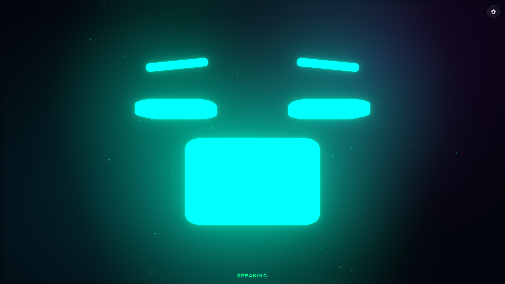
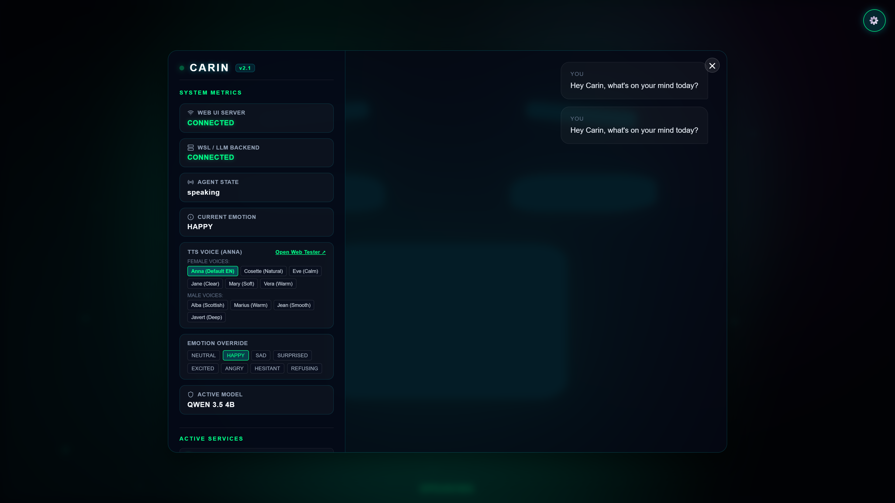
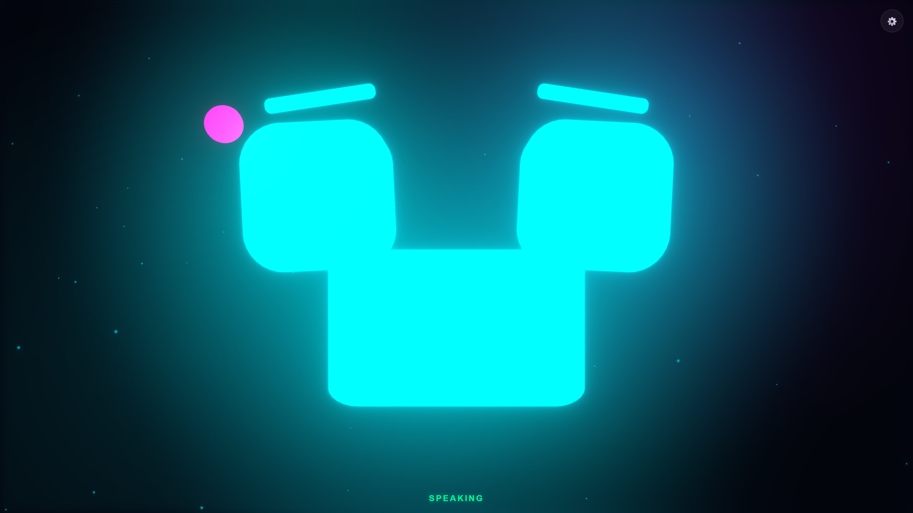
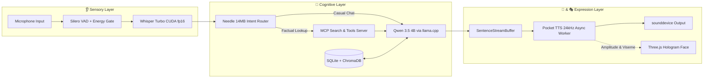

<div align="center">

# 💎 CARIN
### *Zero-Latency Local AI Voice Companion & Holographic Persona*

<p align="center">
  <strong>"Smarter than your average assistant. Faster than human thought."</strong>
</p>

<p align="center">
  
  
  
  
  
</p>

---



</div>

---

## 🌟 The Vision

> **"What if your AI companion didn't just type back, but spoke to you in real-time with genuine emotion, visual presence, and human cadence?"**

**Carin** is a native, zero-latency, full-duplex conversational voice agent engineered to run **100% locally on consumer GPUs**. Built with a modular pipeline separating sensory input, cognitive reasoning, intent classification, neural vocalization, and holographic 3D rendering, Carin achieves a **sub-350ms Time-to-First-Token (TTFT)** without relying on third-party cloud APIs.

---

## 🚀 Key Highlights

* ⚡ **Lightning Fast Speech-to-Speech**: Full round-trip audio latency under ~400ms powered by OpenAI Whisper Turbo, `llama.cpp`, and Kyutai Pocket TTS.
* 🎭 **3D Holographic Persona**: React Three Fiber procedural robot head with dynamic gaze parallax, real-time lip-sync, and emotion-reactive particle aura.
* 🧠 **Needle Agentic Routing**: 14MB / 28MB RAM intent router pre-classifies queries in `<5ms`, executing MCP tools without accidental hallucination loops.
* 🎙️ **Multi-Voice Studio**: 10 built-in neural voice personalities (6 female, 4 male) with live in-app switching and web playground testing.
* 🗄️ **Two-Tier Cognitive Memory**: SQLite session isolation + ChromaDB long-term vector memory with cosine distance relevance filtering.
* 🔒 **100% Local & Sovereign**: No telemetry, no API subscription fees, and complete offline capability once weights are cached.

---

## 📸 Live UI Showcase

<table width="100%">
  <tr>
    <td width="50%" align="center">
      
      <br />
      <strong>🎛️ Glassmorphic Control Panel & Metrics</strong>
      <p><em>Real-time connection stats, live female/male voice selector capsules, and active conversation stream.</em></p>
    </td>
    <td width="50%" align="center">
      
      <br />
      <strong>🎭 Dynamic Emotion-Reactive Persona</strong>
      <p><em>Procedural 3D facial expressions, eyebrow tilt, and chromatic particle aura adapting in real-time.</em></p>
    </td>
  </tr>
</table>

---

## 🏗️ Technical Architecture

Carin is built on a high-throughput, asynchronous pipeline:



### 1. 👂 Sensory Input (`ears.py` & `vad_recorder.py`)
- **Silero Neural VAD**: Ultra-fast voice activity detection coupled with an RMS energy noise floor gate ($\text{RMS} \ge 0.008$) to prevent false triggers on quiet/muted mics.
- **Instant Cutoff**: 350ms turn-taking detection cuts off immediately when you stop speaking.
- **OpenAI Whisper Turbo**: CUDA-accelerated float16 transcription with `condition_on_previous_text=False` for zero silence hallucinations.

### 2. ⚡ Intent Routing (`router.py`)
- **Cactus Compute Needle**: 14MB / 28MB RAM extreme-edge foundation model that determines in `<5ms` whether a tool call (Google web search, time lookup) is needed or if pure streaming chat should be invoked.

### 3. 🧠 Cognitive Core (`brain.py` & `memory.py`)
- **Local LLM Engine**: Qwen 3.5 4B quantized GGUF running via `llama-server` (WSL 2 / CUDA).
- **Dual-Layer Memory**:
  - *Short-Term*: SQLite table partitioned by unique session UUIDs.
  - *Long-Term*: ChromaDB embedding store querying past semantic context ($d \le 0.85$).

### 4. 👄 Neural Speech Synthesis (`mouth.py`)
- **Kyutai Pocket TTS**: 24kHz quantized local speech engine with an asynchronous background worker queue.
- **Cosine Edge Smoothing**: 5ms boundary crossfades eliminate pops, clicks, and buffer underruns.

### 5. 🎭 3D Hologram Interface (`ui-react/`)
- **Procedural Three.js Avatar**: Custom eye and eyebrow geometry with mouse cursor gaze parallax.
- **Particle Aura**: Glowing particle field that modulates particle velocity, dispersion, and hue based on spoken emotion.
- **Real-Time Lip Sync**: Audio amplitude RMS drives mouth openness and dynamic viseme scaling.

---

## 🛠️ Installation & Setup

### Prerequisites
* **OS**: Windows 10/11 (with WSL 2 enabled for `llama-server`)
* **GPU**: NVIDIA RTX GPU (6GB+ VRAM recommended)
* **Python**: 3.11+ (in `venv311`)
* **Node.js**: v18+ (for React UI)

### 1. Clone the Repository
```bash
git clone https://github.com/iam-tarun-86/carin.git
cd carin
```

### 2. Set Up Virtual Environment & Dependencies
```powershell
# Python Backend
python -m venv venv311
.\venv311\Scripts\activate
pip install -r requirements.txt

# React UI
cd ui-react
npm install
cd ..
```

### 3. Start Local LLM Server (WSL 2)
In your WSL 2 terminal, start `llama-server` with Qwen 3.5:
```bash
./llama-server -m /path/to/qwen2.5-coder-7b-instruct.Q4_K_M.gguf --host 0.0.0.0 --port 8085 -ngl 99 -c 32000
```

---

## ⚡ Launching Carin

Launch everything with a single command (auto-manages Pocket TTS, React Dev Server, and the Voice Orchestrator):

### Using PowerShell:
```powershell
.\run.ps1
```

### Using Batch Script:
```cmd
run.bat
```

> **Note:** The launch script runs automated health checks on ports `8085`, `8086`, and `5173`, and guarantees 100% process tree cleanup on exit (`Ctrl+C` or saying *"goodbye"*).

---

## 🎙️ Built-in Voices & Controls

| Voice ID | Gender | Tone & Style |
| :--- | :--- | :--- |
| **`anna`** *(Default)* | Female | Warm, natural, conversational |
| **`cosette`** | Female | Expressive, lively |
| **`eve`** | Female | Calm, composed |
| **`jane`** | Female | Crisp, clear, professional |
| **`mary`** | Female | Soft, gentle |
| **`vera`** | Female | Deep, resonant |
| **`alba`** | Male | Scottish accent, energetic |
| **`marius`** | Male | Warm, friendly |
| **`jean`** | Male | Smooth, narrative |
| **`javert`** | Male | Deep, commanding |

---

## 📊 Latency Benchmarks

| Stage | Technology | Latency |
| :--- | :--- | :--- |
| **Voice Activity Detection** | Silero VAD (32ms chunks) | **~32ms** |
| **Speech-to-Text (STT)** | Whisper Turbo (PyTorch CUDA) | **~250ms** |
| **Intent Classification** | Needle 2 (28MB RAM) | **< 5ms** |
| **Time to First Token (TTFT)** | Qwen 3.5 4B (llama.cpp) | **~300ms** |
| **Speech Synthesis (TTS)** | Pocket TTS (24kHz INT8) | **~120ms** |
| **End-to-End Turnaround** | Full Pipeline | **⚡ ~400ms** |

---

## 📜 License

Distributed under the **MIT License**. See `LICENSE` for more information.

<div align="center">
  <sub>Built with ❤️ by Tarun — Designed for the future of offline ambient computing.</sub>
</div>
